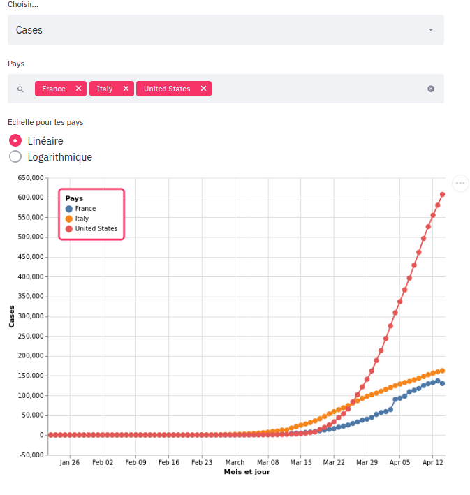
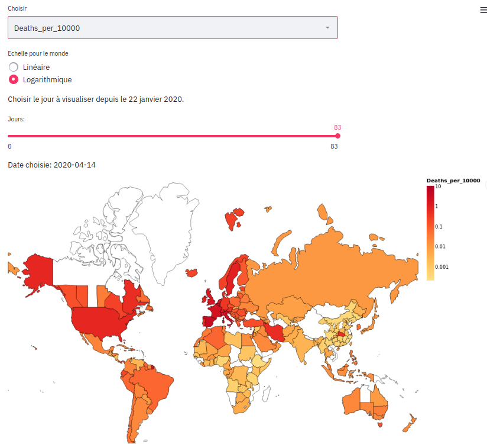

# Covid-19 Visualizer

Cette application web, créée avec Python, Streamlit, et Altair, permet de visualiser les données relatives au Covid-19 dans le monde.
Elle offre des graphiques et une carte interactifs et modifiables.
Les graphiques sont agrandissables, et toutes les figures et cartes enregistrables en PNG, SVG...

## Installation

* Clôner ce dépôt: `git clone https://github.com/MaximeChallon/Covid-19_Visualizer.git` et rentrer dedans.
* Disposer de Python3, et si besoin d'un environnement virtuel: `virtualenv -p python3 env`. Ne pas oublier de l'activer (`source env/bin/activate`).
* Installer les librairies nécessaires : `pip install -r requirements.txt`
* Lancer l'application: `streamlit run run.py`
* Si le navigateur ne s'ouvre pas, aller sur `localhost:8501`

## Informations 
Les données proviennent du dépôt Github [acorpus](https://github.com/acorpus/CombinedCovid), elles-mêmes tirées de l'Université John Hopkins aux Etats-Unis.

## Exemples:

* Graphique temporel des cas pour la France, l'Italie et les Etats-Unis 
* Distribution géographique des décès pour 10000 habitants dans le monde 